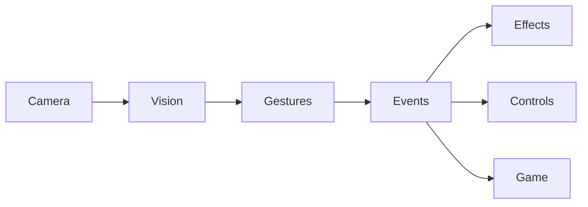

# Spider Vision

Real-time hand tracking, gesture recognition and Spider-Man themed AR effects,
built with **MediaPipe** and **OpenCV** in Python.

The long-term goal is a gesture-controlled AR mini game: shoot webs with the
Spider-Man hand sign, control the mouse with your hand, and wear a mask that
follows your face, all from a regular webcam and running fully on-device.

> **Status:** early development. **M2 (Hand Tracking)** is done, **M3 (Gesture Recognition)** is next.
> See [ROADMAP.md](ROADMAP.md) for progress and technical decisions.

## Planned features

- Hand tracking with 21 landmarks per hand ✅
- Deterministic, geometry-based gesture recognition:
  `OPEN_HAND`, `FIST`, `POINT`, `PINCH`, `SPIDER_MAN`
- Hand-controlled mouse with debounce, cooldown and safe exit
- Face tracking with a Spider-Man mask overlay
- Web shooting and particle effects
- Pose tracking and an AR mini game

## Architecture

Data flows in one direction. Each layer only knows about the layer directly
above it:



| Layer | Responsibility |
|---|---|
| Camera | Opens the webcam and delivers frames |
| Vision | Runs MediaPipe, turns raw landmarks into domain data |
| Gestures | Classifies hand geometry into a gesture |
| Events | Turns stable gestures into events |
| Effects / Controls / Game | React to events: draw AR effects, move the mouse, update the game |

A gesture detector never moves the mouse or draws a web directly. It emits an
event, and the layers below decide what to do with it. This keeps every layer
testable on its own, without a camera.

## Getting started

Requirements: Python 3.12+ (developed and tested on **Python 3.14**, Windows)
and a webcam.

```powershell
git clone https://github.com/senakck/spider-vision.git
cd spider-vision
python -m venv .venv
.\.venv\Scripts\Activate.ps1
python -m pip install -e ".[dev]"
python scripts/download_models.py
```

Start the app (opens your webcam, draws your hand skeleton and an FPS counter;
press **ESC** or **Q** to quit):

```powershell
python -m spider_vision
```

Run the tests (no camera needed):

```powershell
python -m pytest
```

## Project structure

```
src/spider_vision/
    camera/     webcam access, delivers frames
    vision/     MediaPipe wrappers, landmarks -> domain data
    gestures/   hand geometry -> gesture
    events/     stable gestures -> events
    effects/    AR drawing (mask, web, particles)
    controls/   system-level actions (mouse)
    game/       game state and rules
    config.py   all thresholds and settings
    fps.py      FPS measurement for the main loop
    __main__.py entry point: logging, main loop, window and keyboard
scripts/        setup helpers (model download)
tests/          unit tests
```

## Tech stack

| Tool | Purpose | License |
|---|---|---|
| [MediaPipe](https://github.com/google-ai-edge/mediapipe) | Hand, face and pose landmarks | Apache 2.0 |
| [OpenCV](https://opencv.org/) | Camera capture and drawing | Apache 2.0 |
| [NumPy](https://numpy.org/) | Geometry and vector math | BSD |
| [pytest](https://pytest.org/) | Unit tests | MIT |

## Models and privacy

MediaPipe models are not stored in this repository. They are downloaded from
Google's official storage by `scripts/download_models.py` and are licensed
under Apache 2.0.

All image processing happens locally on your machine; camera frames are never
uploaded. Note that the MediaPipe Tasks library itself may send anonymous
performance and usage metrics to Google (see the
[MediaPipe privacy notice](https://pypi.org/project/mediapipe/)).

## License

[MIT](LICENSE) © 2026 Sena Küçük
